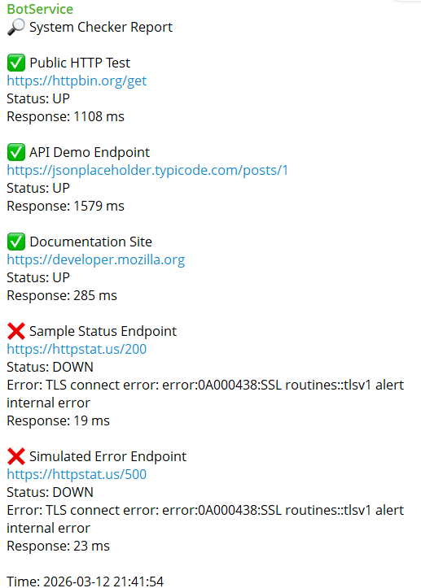

# Simple Website System Checker with Telegram Notification

This project is a lightweight monitoring tool designed to check the availability of websites or APIs and send the results directly to Telegram.
It is built using plain PHP and JSON so it can run easily on shared hosting without installing frameworks or databases.

The idea behind this project is simplicity. Many monitoring tools are powerful but require servers, databases, or complex setup. This tool focuses on a minimal approach where everything runs from just a few files.

The system checks each domain one by one, records the result, sends a notification to Telegram, and saves the status into a JSON file so it can be viewed from a dashboard page.

This project is suitable for developers, small teams, or system owners who want a simple daily monitoring system without relying on third party services.

## Key Features

This system provides the following capabilities.

Daily automated monitoring of multiple domains
Telegram notification for each checked domain
Support for private chat, group, and Telegram topic threads
HTTP status and response time monitoring
Error detection including HTTP errors and script errors
Timeout control for each request
Delay between checks to avoid server overload
JSON based configuration and data storage
Dashboard page to display monitoring results
Works on shared hosting without database

## How the System Works

The workflow is simple.

A cron job triggers the checker script every day at a specific time.
The script reads the list of domains from a JSON file.
Each domain is checked using an HTTP request.
The result is analyzed and formatted into a message.
The message is sent to Telegram.
The result is saved into a JSON status file for the dashboard.

## Project Structure

The system only requires a few files.

system checker folder

config.json
targets.json
status.json
checker.php

config.json stores Telegram configuration and monitoring settings.
targets.json stores the list of domains to check.
status.json stores the results of the latest monitoring run.
chk.php is the main checker script executed by cron.

## Requirements

PHP 7.4 or newer
Curl enabled in PHP
A Telegram bot token
A server that supports cron jobs

This system works well on most shared hosting environments.

## Step 1 Create a Telegram Bot

Open Telegram and search for BotFather.

Start the conversation and create a new bot using the command

/newbot

Follow the instructions and choose a bot name and username.

Once the bot is created you will receive a bot token.

Example

123456789 ABCD example telegram token

Copy this token because it will be used in the configuration file.

## Step 2 Get Your Telegram Chat ID

You need a chat ID so the bot knows where to send the notification.

Send any message to your bot.

Then open the following URL in your browser

https://api.telegram.org/botYOUR_BOT_TOKEN/getUpdates

Look for the chat section in the JSON response.

Example

chat
id 987654321
type private

The value inside id is your chat ID.

## Step 3 Using Telegram Groups

If you want the notification to go to a Telegram group instead of a private chat, add your bot to the group.

Send a message in the group and run the getUpdates API again.

You will find something similar to this.

chat
id minus CHAT_ID
type supergroup

Use this value as the chat ID.

## Step 4 Using Telegram Topic Threads

If the group uses Telegram topics, you also need the message thread id.

Send a message inside the topic and call getUpdates again.

Example

message_thread_id 15

Now you have two values

chat id
message thread id

Both values will be used in the configuration.

## Step 5 Configure the System

Edit the config.json file.

Example configuration

{
"telegram": {
"bot_token": "YOUR_BOT_TOKEN",
"chat_id": "-CHAT_ID",
"message_thread_id": null
},
"settings": {
"request_timeout": 5,
"delay_between_check": 300000
}
}

Explanation

bot token is your Telegram bot token
chat id is the destination chat or group
message thread id is optional and used only for topic groups

request timeout defines how many seconds the system waits for a response
delay between check adds a small pause between each domain check

## Step 6 Add Domains to Monitor

Edit the targets.json file.

Example

{
"targets": [
{
"name": "Main Website",
"url": "https://example.com"
},
{
"name": "API Server",
"url": "https://api.example.com/health"
}
]
}

You can add as many domains as needed.

## Step 7 Setup the Security Key

Open the checker script file.

Find the secret key variable and replace it with your own value.

Example

secret key my strong secret

This prevents unauthorized users from running the script.

## Step 8 Setup Cron Job

Open the cron job settings in your hosting control panel.

Create a cron job to run the script every day at 7 in the morning.

Example cron schedule

0 7 * * *

Command example

wget quiet output https://yourdomain.com/system checker folder/chk.php question mark key your secret key

## Example Telegram Notification

## Scaling Considerations

This system can handle many domains but it is recommended to adjust the delay and timeout settings.

For example

10 domains very fast
50 domains still comfortable
100 domains recommended with small delay

If you monitor hundreds of domains you may want to increase the delay to reduce load.

## Why This Project Exists

This project was created to provide a simple alternative to monitoring services like uptime monitoring platforms.

Instead of relying on external services you can host your own monitoring system that runs entirely from your server.

## License

This project is free to use and modify.

You are welcome to improve it, customize it, and adapt it to your own monitoring needs.
